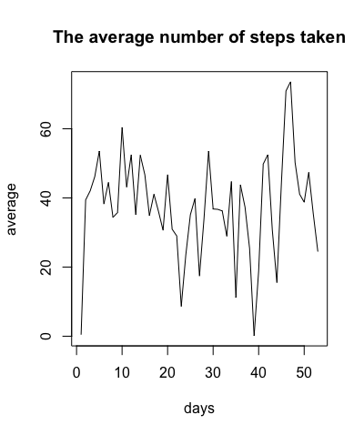

# Reproducible Research: Peer Assessment 1

## Loading and preprocessing the data

mydata = read.csv("activity.csv", header= TRUE)

## What is mean total number of steps taken per day?

steps_day <- tapply(mydata$steps, mydata$date, sum, na.rm=TRUE)

Histogram of the total number of steps taken each day
```{r, echo=TRUE}
steps_day <- tapply(mydata$steps, mydata$date, sum, na.rm=TRUE)
hist(steps_day, main= "The total number of steps taken each day", xlab = "Steps")
```

 

Mean and median number of steps taken each day
```{r, echo=TRUE}
mean(steps_day)
median(steps_day)
```

## What is the average daily activity pattern?

Time series plot of the average number of steps taken
```{r, echo=TRUE}
steps_day_mean <- tapply(mydata$steps, mydata$date, mean, na.rm= TRUE)
ts_steps <- ts(steps_day_mean)
plot(ts_steps[!is.na(ts_steps)], type = "l", main= "The average number of steps taken", xlab= "days", ylab= "average")
```



The 5-minute interval that, on average, contains the maximum number of steps
```{r, echo=TRUE}
interval_5_minute <- which.max(tapply(mydata$steps, mydata$interval, mean, na.rm= TRUE))
names(interval_5_minute)
```

## Imputing missing values

Code to describe and show a strategy for imputing missing data
```{r, echo=TRUE}
index_missing<- which(is.na(mydata))
length(index_missing)
```

Histogram of the total number of steps taken each day after missing values are imputed
```{r, echo=TRUE}
steps_day_na<- tapply(mydata$steps, mydata$date, sum)
mean_na <- mean(steps_day_na[!is.na(steps_day_na)])
index_na= which(is.na(steps_day_na))
steps_day_na[index_na] <- mean_na
hist(steps_day_na, main = "The total number of steps taken each day after missing values are imputed", xlab= "interval")
```


## Are there differences in activity patterns between weekdays and weekends?

Panel plot comparing the average number of steps taken per 5-minute interval across weekdays and weekends
```{r, echo=TRUE}
mydata$dia_semana <- weekdays(as.Date(mydata$date))
mydata$grupo <- ifelse(mydata$dia_semana %in% c("Saturday", "Sunday"), "weekend", "weekday")

weekend_mean <- tapply(mydata$steps[mydata$grupo == "weekend"], mydata$interval[mydata$grupo == "weekend"], mean, na.rm= TRUE)
weekday_mean <- tapply(mydata$steps[mydata$grupo == "weekday"], mydata$interval[mydata$grupo == "weekday"], mean, na.rm= TRUE)

par(mfrow= c(2, 1))
plot(weekend_mean, main= "average # of steps in weekend", ylab= "average # of steps", xlab= "interval", xlim= c(0, 300), ylim= c(0, 250))
plot(weekday_mean, main= "average # of steps in weekday", ylab= "average # of steps", xlab= "interval", xlim= c(0, 300), ylim= c(0, 250))
```


